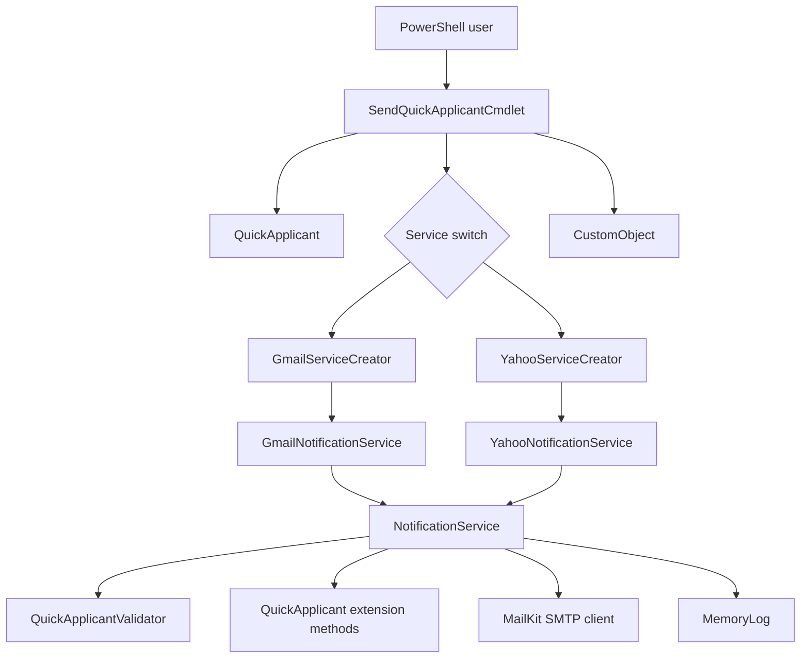
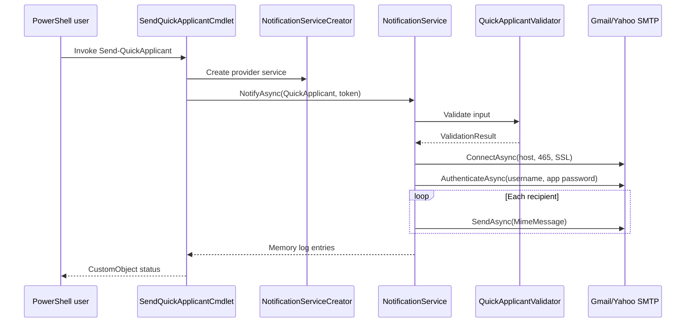
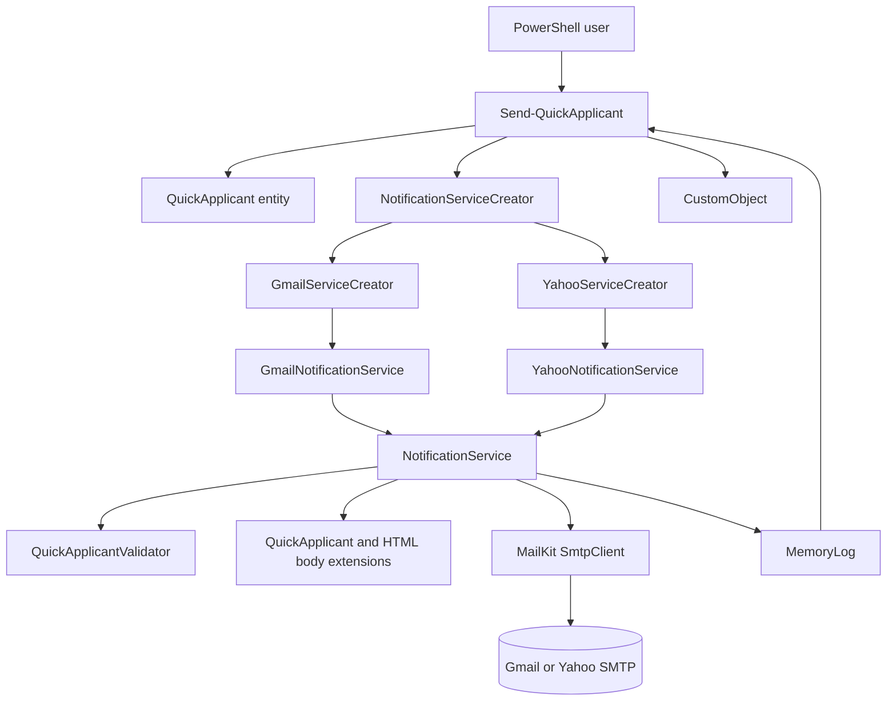
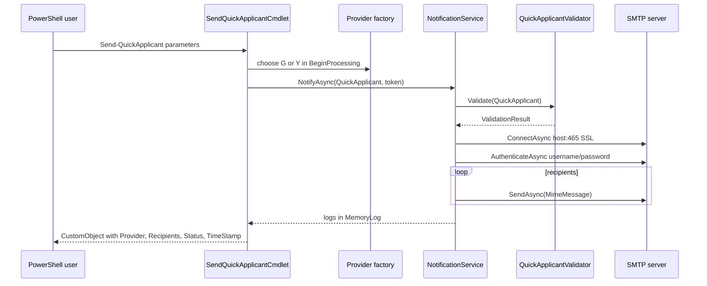
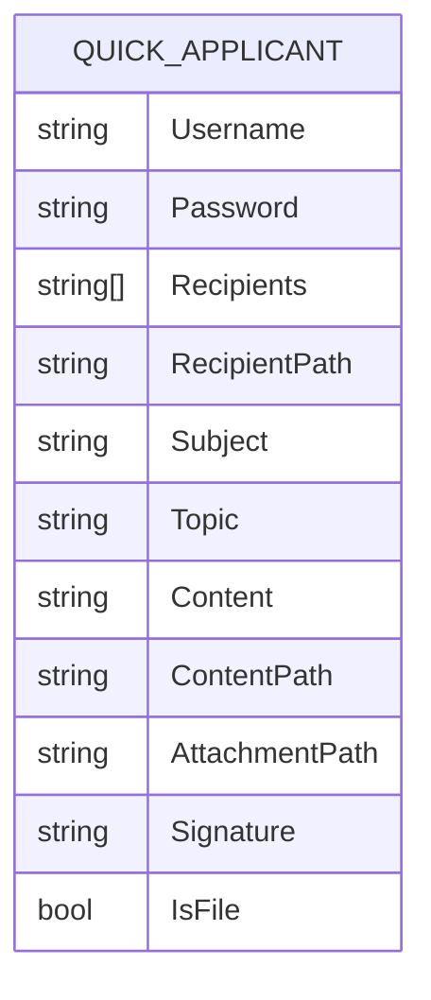

# Bluepen PowerShell Codebase Knowledge

INDEX_VERSION: 2026-06-24-001

This document is a self-contained technical brain dump for the `bluepen.powershell` repository. It was produced by reading the repository directly and ties claims to concrete files, classes, methods, and project metadata.

## High-Level Overview

`bluepen.powershell` is a .NET 8 binary PowerShell module centered on one cmdlet: `Send-QuickApplicant`. The cmdlet sends individual email notifications through Gmail or Yahoo SMTP using MailKit and MimeKit. The repository is also a reference framework for building binary PowerShell modules with separated cmdlet, domain, and service assemblies.

Primary users are PowerShell 7 users and developers who need either:

- A working command-line email notification tool.
- A sample binary cmdlet architecture using factories, validation, service abstractions, and module packaging.

The core feature lets a user provide credentials, mail service, recipients, subject, topic, content, optional attachment, and signature. Inputs can come directly from command parameters or from files when the `-File` switch is used.

## File Index

| Priority | Path | Type | Lines | Hash8 | Notes |
|---|---:|---:|---:|---:|---|
| High | `bluepen.powershell.cmdlets/SendQuickApplicantCmdlet.cs` | C# | 191 | 022EA65B | PowerShell cmdlet entry point and command lifecycle. |
| High | `bluepen.powershell.domain/services/NotificationService.cs` | C# | 126 | 5665F842 | Base SMTP notification implementation and recipient send loop. |
| High | `bluepen.powershell.services/validators/QuickApplicantValidator.cs` | C# | 142 | D8172445 | Central input, email, file, and attachment validation. |
| High | `bluepen.powershell.domain/entities/QuickApplicant.cs` | C# | 66 | F44C89A0 | Data carrier for cmdlet inputs. |
| High | `bluepen.powershell.cmdlets/bluepen.powershell.cmdlets.csproj` | MSBuild | 56 | 8A53846D | Module project, dependencies, packing, and post-build copy layout. |
| High | `bluepen.powershell.cmdlets/bluepen.powershell.cmdlets.psd1` | PowerShell manifest | 88 | C8141E6C | Module manifest, root module, required assemblies, exported commands. |
| Medium | `bluepen.powershell.services/factories/GmailServiceCreator.cs` | C# | 29 | EF95B671 | Factory for Gmail notification service. |
| Medium | `bluepen.powershell.services/factories/YahooServiceCreator.cs` | C# | 29 | DBDBD7A2 | Factory for Yahoo notification service. |
| Medium | `bluepen.powershell.services/GmailNotificationService.cs` | C# | 28 | 8A0BA940 | Gmail SMTP service wrapper. |
| Medium | `bluepen.powershell.services/YahooNotificationService.cs` | C# | 27 | 42284A15 | Yahoo SMTP service wrapper. |
| Medium | `bluepen.powershell.domain/emethods/QuickApplicantExtensions.cs` | C# | 66 | 8964513F | Reads content and recipient values from inline parameters or files. |
| Medium | `bluepen.powershell.domain/emethods/HTMLBodyExtensions.cs` | C# | 20 | 2ECF5474 | Replaces template tokens and line breaks for HTML body output. |
| Medium | `bluepen.powershell.domain/services/MemoryLog.cs` | C# | 61 | 35549894 | Per-cmdlet in-memory log implementation. |
| Medium | `bluepen.powershell.domain/exceptions/ContentProvidedException.cs` | C# | 29 | 027CA6C2 | Validation exception that aggregates error messages. |
| Medium | `bluepen.powershell.domain/services/abstracts/NotificationServiceCreator.cs` | C# | 16 | 87E6C4CC | Abstract factory base. |
| Medium | `bluepen.powershell.domain/services/interfaces/INotificationService.cs` | C# | 18 | 44A5F61E | Notification service contract. |
| Medium | `bluepen.powershell.domain/services/interfaces/IValidator.cs` | C# | 16 | 34802ACA | Validator contract. |
| Medium | `bluepen.powershell.domain/services/interfaces/IMemoryLog.cs` | C# | 28 | 5B6CB0E6 | Memory log contract. |
| Medium | `bluepen.powershell.domain/services/ValidationResults.cs` | C# | 8 | 072DB398 | Validation result model. |
| Medium | `bluepen.powershell.services/customstructures/CustomObject.cs` | C# | 30 | 396BB3AA | Output object returned by the cmdlet. |
| Medium | `bluepen.powershell.domain/bluepen.powershell.domain.csproj` | MSBuild | 13 | BA31BA84 | Domain target and dependencies. |
| Medium | `bluepen.powershell.services/bluepen.powershell.services.csproj` | MSBuild | 30 | AC89532E | Service target, excluded duplicate files, dependencies. |
| Low | `README.md` | Markdown | 153 | 05CAF21E | User-facing overview, usage, and packaging notes. |
| Low | `Requirements.md` | Markdown | 159 | 7142FC7B | Requirements used to generate this document. |
| Low | `.build/fetch-access-refresh-tokens.ps1` | PowerShell | 18 | 03E1FE80 | Draft OAuth helper script with placeholder values. |
| Low | `bluepen.powershell.cmdlets/content.txt` | Text | 5 | 7A6C23BD | Sample message content. |
| Low | `bluepen.powershell.cmdlets/recipients.txt` | Text | 2 | 64177EB4 | Sample recipient file. |
| Low | `bluepen.powershell.cmdlets/attachment.pdf` | PDF | 0 | 6B000F1F | Sample attachment. |
| Low | `.github/copilot-instructions.md` | Markdown | 3 | 74B669AB | Azure-related Copilot instructions. |
| Low | `.gitignore` | Git config | 16 | C5EB35AF | Visual Studio build artifact ignores. |
| Low | `.gitattributes` | Git config | 54 | 45A7CBB7 | Line ending normalization. |
| Low | `bluepen.powershell.sln` | Visual Studio solution | 36 | FDBAE856 | Solution with three projects. |

## Tech Stack and Dependencies

- Runtime: .NET 8 targeting PowerShell 7.
- Cmdlet framework: `System.Management.Automation` referenced by `bluepen.powershell.cmdlets/bluepen.powershell.cmdlets.csproj` with `PrivateAssets="All"`, meaning PowerShell supplies it at runtime.
- Email: MailKit and MimeKit are used for SMTP, MIME messages, and email address parsing.
- Packaging: `bluepen.powershell.cmdlets/bluepen.powershell.cmdlets.csproj` uses `CopyLocalLockFileAssemblies`, content packing, and a post-build `xcopy` target to create a publish folder.
- Validation: The repository references FluentValidation in `bluepen.powershell.services/bluepen.powershell.services.csproj`, but the active validator is manual code in `QuickApplicantValidator`.

## Project Structure

The solution has three projects:

- `bluepen.powershell.cmdlets`: PowerShell-facing binary module project. It owns `SendQuickApplicantCmdlet`, the `.psd1` module manifest, sample input files, and packaging rules.
- `bluepen.powershell.domain`: Domain-style contracts, entities, extension methods, base notification service, validation result type, exception type, and memory log.
- `bluepen.powershell.services`: Provider-specific services, service factories, validator implementation, and cmdlet output DTO.

The intended architecture is layered, but the current implementation places SMTP behavior in the domain project through `NotificationService`. That means the domain assembly depends on MailKit/MimeKit and file I/O helpers.

## Core Features and Business Purpose

### Send Quick Applicant Email Notifications

Business purpose: send personalized, lightweight email notifications from the shell through a user-selected external mail provider.

Technical path:

- Entry point: `bluepen.powershell.cmdlets/SendQuickApplicantCmdlet.cs`.
- Input model: `bluepen.powershell.domain/entities/QuickApplicant.cs`.
- Provider selection: `BeginProcessing()` maps `Service` value `G` to Gmail and `Y` to Yahoo.
- Validation: `bluepen.powershell.services/validators/QuickApplicantValidator.cs` checks required fields, email formats, file existence, and file sizes.
- Send operation: `bluepen.powershell.domain/services/NotificationService.cs` connects to SMTP, authenticates, builds MIME content, loops recipients, and sends one message per recipient.
- Output: `bluepen.powershell.services/customstructures/CustomObject.cs` is emitted with provider, recipients, status, and timestamp.

### Inline Input Mode

Business purpose: support fast ad hoc email sending directly from PowerShell arguments.

Technical path:

- Parameter set: `SwitchIsOff` in `SendQuickApplicantCmdlet`.
- Required parameters: `Recipients`, `Content`, `Subject`, `Topic`, `Signature`, `Credential`, `Service`.
- `QuickApplicant.IsFile` is false.
- `QuickApplicantExtensions.GetContent()` returns `Content`.
- `QuickApplicantExtensions.GetRecipients()` returns `Recipients`.

### File Input Mode

Business purpose: support reusable recipient lists and longer message bodies without putting all content on the command line.

Technical path:

- Parameter set: `SwitchIsOn` in `SendQuickApplicantCmdlet`.
- Required parameters: `RecipientPath`, `ContentPath`, `Subject`, `Topic`, `Signature`, `Credential`, `Service`, and `File`.
- `QuickApplicant.IsFile` is true.
- `QuickApplicantExtensions.GetContent()` reads `ContentPath`.
- `QuickApplicantExtensions.GetRecipients()` reads `RecipientPath`, splitting on Windows or Unix newlines and trimming entries.

### Optional Attachment

Business purpose: allow a document, resume, PDF, or other small supporting artifact to be sent with each notification.

Technical path:

- `AttachmentPath` is optional in `SendQuickApplicantCmdlet`.
- `QuickApplicantValidator` verifies existence and enforces a 300 KB size limit when provided.
- `NotificationService.NotifyAsync()` reads bytes and adds the file as a MIME attachment.

### Packaging and Distribution

Business purpose: produce a PowerShell-importable binary module folder that includes the cmdlet DLL, class library DLLs, and third-party dependencies.

Technical path:

- `bluepen.powershell.cmdlets/bluepen.powershell.cmdlets.csproj` targets `net8.0`, copies dependencies locally, includes sample files, packs content into the package root, and runs post-build `xcopy` commands.
- `bluepen.powershell.cmdlets/bluepen.powershell.cmdlets.psd1` sets `RootModule`, `RequiredAssemblies`, `FileList`, and exported command metadata.
- `README.md` documents manual import and distribution patterns.

## Architecture Deep Dive

### Component Map



### Runtime Sequence



### Data Flow

1. User invokes `Send-QuickApplicant` in PowerShell.
2. PowerShell binds parameters on `SendQuickApplicantCmdlet`.
3. `BeginProcessing()` chooses `GmailServiceCreator` or `YahooServiceCreator` based on `Service.ToUpper()`.
4. `ProcessRecord()` checks `ShouldProcess`, creates `QuickApplicant`, extracts plaintext password from `PSCredential`, and calls `NotifyAsync()` synchronously through `.GetAwaiter().GetResult()`.
5. `NotificationService.NotifyAsync()` validates the model before reading content or sending mail.
6. Content and recipients are resolved from either inline values or files.
7. `BodyBuilder` constructs HTML and text bodies by replacing `{topic}` and `{signature}` tokens.
8. MailKit sends one MIME email per recipient.
9. Success or error messages are written to `MemoryLog`.
10. The cmdlet writes verbose log entries and a `CustomObject` result.

There is no database, web server, authentication service, background job system, cache, or external API beyond SMTP and local file I/O.

## Third-Party Integrations

- Gmail SMTP: `GmailNotificationService` passes `smtp.gmail.com` to the base service.
- Yahoo SMTP: `YahooNotificationService` passes `smtp.mail.yahoo.com` to the base service.
- MailKit SMTP client: `NotificationService` creates `MailKit.Net.Smtp.SmtpClient`, connects on port 465 with `SecureSocketOptions.SslOnConnect`, authenticates, sends, and disconnects.
- MimeKit: `MimeMessage`, `MailboxAddress`, and `BodyBuilder` are used for message formatting and validation.

## Cross-Cutting Concerns

### Security

- Credentials enter via `PSCredential`, which is appropriate for PowerShell UX.
- `SendQuickApplicantCmdlet.ProcessRecord()` converts the secure password into a plaintext string before authentication. This is needed by MailKit but should be kept scoped as tightly as possible.
- `.build/fetch-access-refresh-tokens.ps1` contains placeholder OAuth client settings and should not be used as-is for production authentication.
- HTML body content is built with plain string replacement and newline conversion. User-supplied content is not HTML-encoded.
- Attachment and file reads are local path based with size limits, but no extension allowlist or path policy.

### Logging and Observability

- `MemoryLog` stores messages in memory and the cmdlet writes them as verbose output.
- Per-recipient send failures are swallowed inside the send loop and logged, allowing later recipients to continue.
- Outer failures in `NotificationService.NotifyAsync()` are logged and not rethrown. This means the cmdlet can still return `Status = "Sent"` even after validation or SMTP failures.

### Cancellation

- `SendQuickApplicantCmdlet` owns a `CancellationTokenSource` and cancels it in `StopProcessing()`.
- `NotificationService.NotifyAsync()` checks cancellation before each send and breaks the loop.
- `ConnectAsync`, `AuthenticateAsync`, `SendAsync`, `DisconnectAsync`, and `Task.Delay` do not receive the cancellation token, so cancellation is cooperative but incomplete.

### Packaging

- The module project tries to pack DLLs and the manifest into the package root.
- The post-build target is Windows-specific because it uses `xcopy`.
- `System.Management.Automation` is correctly kept private so it is not distributed as part of the module.

## Feature-by-Feature Technical Notes

### Cmdlet Lifecycle

`SendQuickApplicantCmdlet` derives from `Cmdlet`, not `PSCmdlet`. It implements `BeginProcessing`, `ProcessRecord`, `EndProcessing`, and `StopProcessing`.

Important details:

- `SupportsShouldProcess = true` enables `-WhatIf` and confirmation behavior.
- `ConfirmImpact = ConfirmImpact.Low` controls confirmation behavior.
- Parameter sets separate inline mode from file mode.
- `ProcessRecord()` synchronously waits on async notification logic.
- `finally` disposes `cancellationTokenSource`, so the cmdlet instance cannot safely process more records after one `ProcessRecord()` call.

### Provider Selection

`BeginProcessing()` accepts only `Y` and `G` service values. Any other value writes an error. It does not stop processing explicitly, so `serviceCreator` may remain null and `ProcessRecord()` may continue with a null service.

The provider factories instantiate provider wrappers with a fresh `QuickApplicantValidator` and shared `IMemoryLog`.

### Validation Rules

`QuickApplicantValidator.Validate()` enforces:

- Required username, password, subject, topic, and signature.
- File mode requires `RecipientPath` and `ContentPath`.
- Recipient file must exist, contain valid email addresses, and be at most 50 KB.
- Content file must exist, be non-empty, and be at most 100 KB.
- Inline mode requires at least one recipient and non-empty content.
- Inline recipients must parse as email addresses through MimeKit.
- Attachment file must exist and be at most 300 KB.

Potential issue: size calculations use integer division before assignment to `double`, so `fileInfo.Length / 1024` truncates fractional KB.

### Content Formatting

`HTMLBodyExtensions.GetHTMLBody()` replaces `{topic}` and `{signature}`, then converts CRLF, LF, and CR to `<BR />`. Text body generation performs the same token replacement without HTML line break conversion.

There is no templating engine, escaping, or culture-specific formatting.

### Notification Sending

`NotificationService.NotifyAsync()`:

- Validates input first.
- Opens one SMTP connection for all recipients.
- Authenticates once.
- Builds one body once and reuses it for all recipients.
- Creates a new `MimeMessage` for each recipient.
- Adds one recipient per message, which avoids exposing the full recipient list to all recipients.
- Delays five seconds after each send.

Potential issue: success logs include username, subject, topic, and signature but not recipient, while failure logs include only the error message. This can make troubleshooting hard.

### Output Contract

The cmdlet outputs `CustomObject` with:

- `Provider`: `Gmail` when service is `G`; otherwise `Yahoo`.
- `Recipients`: recipient file path in file mode, or joined recipient strings in inline mode.
- `Status`: always `Sent` if no exception escapes back to `ProcessRecord()`.
- `TimeStamp`: local `DateTime.Now`.

Potential issue: because `NotificationService` catches and logs most failures, the output status can be misleading.

## Things You Must Know Before Changing Code

- `bluepen.powershell.services/bluepen.powershell.services.csproj` explicitly excludes `emethods/**`, `exceptions/**`, and `MemoryLog.cs`. Duplicate files exist in the service project folder but are not compiled.
- The active `ContentProvidedException`, `MemoryLog`, and extension methods are in the domain project.
- `NotificationService` lives in the domain project but performs infrastructure operations: SMTP, file reads, MIME construction, and delays.
- There are no test projects in the solution.
- The module manifest exports wildcard functions, cmdlets, variables, and aliases. This is convenient for a sample but broad for a distributed module.
- The README examples contain placeholder and sample recipient values and assume app passwords for Gmail/Yahoo.
- The `.build/fetch-access-refresh-tokens.ps1` script is incomplete: it opens an OAuth URL and reads an auth code, but it does not exchange the code for tokens.
- File-mode validation reads recipient and content files, then notification sending reads them again.
- `NotifyAsync()` catches exceptions internally and does not report structured failure status to the cmdlet.
- `MailboxAddress.TryParse` validates syntax, not deliverability.

## Major Risks and Edge Cases

| Risk | Location | Impact |
|---|---|---|
| False success output | `NotificationService.NotifyAsync()`, `SendQuickApplicantCmdlet.ProcessRecord()` | Validation or SMTP failures can be logged but still produce `Status = "Sent"`. |
| Null service path | `SendQuickApplicantCmdlet.BeginProcessing()` | Invalid service writes an error but does not reliably stop later processing. |
| HTML injection/content rendering | `HTMLBodyExtensions.GetHTMLBody()` | User-provided content can become raw HTML. |
| Plaintext password lifetime | `SendQuickApplicantCmdlet.ProcessRecord()` | SecureString is converted to string for MailKit and held in `QuickApplicant`. |
| Incomplete cancellation | `NotificationService.NotifyAsync()` | Network calls and delay ignore cancellation token. |
| Blocking async in cmdlet | `ProcessRecord()` | `.GetAwaiter().GetResult()` can block the pipeline and reduce responsiveness. |
| Integer truncation in file-size checks | `QuickApplicantValidator` | Size limits are slightly imprecise. |
| No tests | Solution-level | Refactoring has limited regression safety. |
| Windows-specific post-build | Cmdlet `.csproj` | Non-Windows builds may fail or skip publish layout expectations. |
| Duplicate excluded files | Services project | Maintainers may edit inactive files and see no behavior change. |

## Glossary

- QuickApplicant: The data model representing one invocation's email notification configuration.
- Cmdlet: A compiled PowerShell command implemented as a .NET class.
- Binary module: A PowerShell module implemented by a compiled DLL rather than a script module.
- Provider: The selected email service, currently Gmail or Yahoo.
- App password: Provider-generated password used for SMTP authentication when normal account password login is not allowed.
- Parameter set: PowerShell mechanism that selects mutually exclusive parameter combinations.
- Inline mode: Invocation mode where recipients and content are supplied directly as parameters.
- File mode: Invocation mode where recipient list and content are read from files.
- MemoryLog: In-memory list of status/error messages for one cmdlet execution path.
- RequiredAssemblies: PowerShell module manifest entry listing assemblies to load with the module.

## Key Classes and Methods

| Class or File | Responsibility |
|---|---|
| `SendQuickApplicantCmdlet` | PowerShell command surface, parameter binding, provider selection, ShouldProcess handling, output writing. |
| `QuickApplicant` | Data object carrying credentials, provider-independent message inputs, paths, and mode flag. |
| `NotificationServiceCreator` | Abstract factory for provider notification services. |
| `GmailServiceCreator` | Creates `GmailNotificationService`. |
| `YahooServiceCreator` | Creates `YahooNotificationService`. |
| `GmailNotificationService` | Provider wrapper that configures Gmail SMTP host. |
| `YahooNotificationService` | Provider wrapper that configures Yahoo SMTP host. |
| `NotificationService.NotifyAsync()` | Shared send implementation for validation, SMTP connection, authentication, MIME construction, send loop, and logging. |
| `QuickApplicantValidator.Validate()` | Central validation for required values, email syntax, files, and attachment size. |
| `QuickApplicantExtensions.GetContent()` | Resolves content from inline text or file path. |
| `QuickApplicantExtensions.GetRecipients()` | Resolves recipients from inline array or recipient file. |
| `HTMLBodyExtensions.GetHTMLBody()` | Performs token replacement and newline-to-HTML conversion. |
| `MemoryLog` | Stores logs until cmdlet writes verbose output. |
| `CustomObject` | Structured PowerShell output object. |

## Internal APIs

### PowerShell Cmdlet

Command name: `Send-QuickApplicant`

Inline example:

```powershell
Send-QuickApplicant -m G -cr (Get-Credential) -r user@example.com -s "Subject" -t "Topic" -c "Hello {topic}. Regards, {signature}" -sg "Sender"
```

File example:

```powershell
Send-QuickApplicant -m Y -cr (Get-Credential) -rp C:\mail\recipients.txt -s "Subject" -t "Topic" -cp C:\mail\content.txt -a C:\mail\attachment.pdf -sg "Sender" -File
```

### Notification Service Contract

`INotificationService.NotifyAsync(QuickApplicant quickApplicant, CancellationToken token)` sends notifications and returns a `Task`.

### Validator Contract

`IValidator.Validate(QuickApplicant quickApplicant)` returns `ValidationResult` with `IsValid` and `Errors`.

## Database Schema

There is no database schema. All runtime data is supplied through PowerShell parameters, local files, and in-memory objects.

## Assumptions

| Assumption | Confidence | Basis |
|---|---:|---|
| The repository is intended as both working cmdlet and educational framework. | High | README explicitly describes both purposes. |
| Gmail/Yahoo require app passwords for current authentication flow. | High | README and credential naming refer to app passwords; implementation uses SMTP username/password. |
| The duplicate service-project extension and exception files are inactive. | High | `bluepen.powershell.services.csproj` removes them from compilation. |
| The `.build` OAuth script is experimental and incomplete. | Medium | It has placeholders and no token exchange implementation. |

## Open Questions

- Should failures in any recipient cause the cmdlet output status to be `Failed` or `PartialFailure`?
- Should the command support OAuth2/XOAUTH2 instead of app passwords?
- Should provider selection accept full names like `Gmail` and `Yahoo`, not only `G` and `Y`?
- Should file size limits be configurable parameters?
- Should the module target only PowerShell 7.4, or a broader supported range?

## STATE BLOCK

- INDEX_VERSION: 2026-06-24-001
- FILE_MAP_SUMMARY: Three-project .NET 8 solution. `cmdlets` contains PowerShell module entry and packaging; `domain` contains entities, contracts, base SMTP service, extensions, exception, validation result, and memory log; `services` contains provider wrappers, factories, output DTO, and active validator. No tests are present.
- OPEN_QUESTIONS: Failure semantics, OAuth support, provider names, configurable limits, supported PowerShell versions.
- KNOWN_RISKS: False success output, incomplete cancellation, plaintext credential conversion, raw HTML body construction, duplicate inactive files, no automated tests.
- GLOSSARY_DELTA: QuickApplicant, inline mode, file mode, binary module, app password, provider, MemoryLog.

## Next Steps for Implementers

1. Add focused tests around validation, provider selection, file/inline input resolution, and failure status reporting.
2. Change `NotificationService.NotifyAsync()` to return a structured result or throw validation/provider failures so the cmdlet can report accurate status.
3. Move SMTP/file infrastructure out of the domain project or rename the architecture documentation to match the current layering.
4. Replace duplicate excluded service-project files with a clear deletion or documented migration path.
5. Harden HTML content generation, credential handling, cancellation, and packaging portability before external distribution.# Bluepen PowerShell Codebase Knowledge

Generated on: 2026-06-24

This document is a standalone technical brain dump for the `bluepen.powershell` repository. It describes the current .NET 8 binary PowerShell module, the QuickApplicant email workflow, its architecture, runtime data flow, risks, and extension points. File references are relative to the repository root.

## STATE BLOCK - Final

- INDEX_VERSION: 2026-06-24.1
- FILE_MAP_SUMMARY: Three .NET 8 projects: `bluepen.powershell.cmdlets`, `bluepen.powershell.domain`, and `bluepen.powershell.services`; root docs/config; sample mail content files; `.build` helper script; no test project found.
- OPEN_QUESTIONS: Whether OAuth is a future requirement or only an experiment; whether the module is intended for public PowerShell Gallery distribution; whether the `services/emethods`, `services/exceptions`, and `services/MemoryLog.cs` files are intentionally retained despite being excluded from compilation.
- KNOWN_RISKS: SMTP password handling, HTML injection risk, swallowed send failures, broad module exports, no tests, hardcoded SMTP/port behavior, duplicated or excluded code, integer file-size calculations, and incomplete cancellation propagation.
- GLOSSARY_DELTA: QuickApplicant, notification service creator, provider service, app password, memory log, file mode, inline mode.

## High-Level Overview

### Purpose

This repository implements a reusable binary PowerShell module framework and one concrete cmdlet: `Send-QuickApplicant`. The cmdlet sends one email notification per recipient through either Gmail or Yahoo SMTP using MailKit and MimeKit.

The project has two business purposes:

- Demonstrate how to build, package, and distribute a PowerShell 7 binary module in C#.
- Provide a small reusable notification workflow that can send templated application-style messages to recipients from inline parameters or input files.

### Main Features

- PowerShell command entry point: `bluepen.powershell.cmdlets/SendQuickApplicantCmdlet.cs` exposes `Send-QuickApplicant` with credential, provider, recipient, subject, topic, content, signature, attachment, and `-File` options.
- Provider selection: `bluepen.powershell.services/factories/GmailServiceCreator.cs` and `bluepen.powershell.services/factories/YahooServiceCreator.cs` choose concrete SMTP services through `NotificationServiceCreator`.
- Input validation: `bluepen.powershell.services/validators/QuickApplicantValidator.cs` checks required fields, email format, file existence, and size limits.
- Email dispatch: `bluepen.powershell.domain/services/NotificationService.cs` connects to SMTP over SSL, authenticates, builds MIME messages, attaches a file if present, and sends individual messages.
- Content templating: `bluepen.powershell.domain/emethods/HTMLBodyExtensions.cs` replaces `{topic}` and `{signature}` tokens and converts line breaks to `<BR />`.
- Module packaging: `bluepen.powershell.cmdlets/bluepen.powershell.cmdlets.csproj` and `bluepen.powershell.cmdlets/bluepen.powershell.cmdlets.psd1` define target framework, dependencies, required assemblies, sample files, NuGet packaging, and publish layout.

### Business Feature Map

| Feature | Business purpose | Primary files |
| --- | --- | --- |
| `Send-QuickApplicant` cmdlet | Let a PowerShell user send application-style notifications without writing SMTP code | `bluepen.powershell.cmdlets/SendQuickApplicantCmdlet.cs` |
| Inline input mode | Fast one-off send from command-line arguments | `SendQuickApplicantCmdlet.cs`, `QuickApplicantValidator.cs` |
| File input mode | Batch-friendly send from recipient/content text files | `SendQuickApplicantCmdlet.cs`, `QuickApplicantExtensions.cs` |
| Gmail/Yahoo providers | Support common personal email providers with provider-specific SMTP hosts | `GmailNotificationService.cs`, `YahooNotificationService.cs` |
| Validation | Prevent obvious user input mistakes before SMTP send | `QuickApplicantValidator.cs`, `ValidationResults.cs` |
| Packaging/distribution | Make the binary module importable in PowerShell 7 | `bluepen.powershell.cmdlets.csproj`, `bluepen.powershell.cmdlets.psd1`, `README.md` |

## File Index

Priority legend: `P1` entry point/runtime critical, `P2` important support/config, `P3` docs/sample/excluded support.

| # | Priority | Path | Type | Lines | Hash8 | Notes |
| --- | --- | --- | --- | ---: | --- | --- |
| 1 | P1 | `bluepen.powershell.cmdlets/SendQuickApplicantCmdlet.cs` | Cmdlet | 191 | 022EA65B | PowerShell entry point and orchestration |
| 2 | P1 | `bluepen.powershell.domain/services/NotificationService.cs` | Service | 126 | 5665F842 | SMTP connection, auth, MIME construction, send loop |
| 3 | P1 | `bluepen.powershell.services/validators/QuickApplicantValidator.cs` | Validator | 142 | D8172445 | Runtime input and file validation |
| 4 | P1 | `bluepen.powershell.domain/entities/QuickApplicant.cs` | Entity | 66 | F44C89A0 | Data contract passed from cmdlet to services |
| 5 | P1 | `bluepen.powershell.services/factories/GmailServiceCreator.cs` | Factory | 29 | EF95B671 | Creates Gmail provider service |
| 6 | P1 | `bluepen.powershell.services/factories/YahooServiceCreator.cs` | Factory | 29 | DBDBD7A2 | Creates Yahoo provider service |
| 7 | P1 | `bluepen.powershell.services/GmailNotificationService.cs` | Provider | 28 | 8A0BA940 | Gmail SMTP wrapper |
| 8 | P1 | `bluepen.powershell.services/YahooNotificationService.cs` | Provider | 27 | 42284A15 | Yahoo SMTP wrapper |
| 9 | P2 | `bluepen.powershell.cmdlets/bluepen.powershell.cmdlets.csproj` | Project | 56 | 8A53846D | Packaging, dependencies, target framework |
| 10 | P2 | `bluepen.powershell.cmdlets/bluepen.powershell.cmdlets.psd1` | Manifest | 88 | C8141E6C | PowerShell module metadata |
| 11 | P2 | `bluepen.powershell.domain/bluepen.powershell.domain.csproj` | Project | 13 | BA31BA84 | Domain project and package refs |
| 12 | P2 | `bluepen.powershell.services/bluepen.powershell.services.csproj` | Project | 30 | AC89532E | Services project, compile exclusions |
| 13 | P2 | `bluepen.powershell.domain/emethods/QuickApplicantExtensions.cs` | Extensions | 66 | 8964513F | Reads content and recipients from inline/file input |
| 14 | P2 | `bluepen.powershell.domain/emethods/HTMLBodyExtensions.cs` | Extensions | 20 | 2ECF5474 | Builds simple HTML body |
| 15 | P2 | `bluepen.powershell.domain/services/abstracts/NotificationServiceCreator.cs` | Abstract factory | 16 | 87E6C4CC | Provider factory abstraction |
| 16 | P2 | `bluepen.powershell.domain/services/interfaces/INotificationService.cs` | Interface | 18 | 44A5F61E | Notification service contract |
| 17 | P2 | `bluepen.powershell.domain/services/interfaces/IValidator.cs` | Interface | 16 | 34802ACA | Validator contract |
| 18 | P2 | `bluepen.powershell.domain/services/interfaces/IMemoryLog.cs` | Interface | 28 | 5B6CB0E6 | In-memory log contract |
| 19 | P2 | `bluepen.powershell.domain/services/MemoryLog.cs` | Log service | 61 | 35549894 | Per-cmdlet in-memory log implementation |
| 20 | P2 | `bluepen.powershell.domain/services/ValidationResults.cs` | Validation result | 8 | 072DB398 | Validation result container |
| 21 | P2 | `bluepen.powershell.domain/exceptions/ContentProvidedException.cs` | Exception | 29 | 027CA6C2 | Aggregates validation errors |
| 22 | P2 | `bluepen.powershell.services/customstructures/CustomObject.cs` | Output DTO | 30 | 396BB3AA | Structured object returned to PowerShell |
| 23 | P2 | `bluepen.powershell.sln` | Solution | 36 | FDBAE856 | Visual Studio solution with three projects |
| 24 | P3 | `README.md` | Documentation | 153 | 05CAF21E | Setup, usage, packaging notes |
| 25 | P3 | `Requirements.md` | Requirements | 159 | 7142FC7B | Documentation-generation requirements |
| 26 | P3 | `.build/fetch-access-refresh-tokens.ps1` | Script | 18 | 03E1FE80 | OAuth experiment/helper with placeholder secrets |
| 27 | P3 | `bluepen.powershell.cmdlets/content.txt` | Sample | 5 | 7A6C23BD | Sample content file |
| 28 | P3 | `bluepen.powershell.cmdlets/recipients.txt` | Sample | 2 | 64177EB4 | Sample recipients file |
| 29 | P3 | `bluepen.powershell.cmdlets/attachment.pdf` | Sample | 0 | 6B000F1F | Sample attachment |
| 30 | P3 | `bluepen.powershell.services/emethods/QuickApplicantExtensions.cs` | Excluded duplicate | 67 | 7B5308B8 | Excluded from services compilation |
| 31 | P3 | `bluepen.powershell.services/emethods/HTMLBodyExtensions.cs` | Excluded duplicate | 20 | 209A5F84 | Excluded from services compilation |
| 32 | P3 | `bluepen.powershell.services/exceptions/ContentProvidedException.cs` | Excluded duplicate | 29 | 1E2E024B | Excluded from services compilation |
| 33 | P3 | `bluepen.powershell.services/MemoryLog.cs` | Excluded duplicate | 42 | 938C464A | Excluded from services compilation |
| 34 | P3 | `.github/copilot-instructions.md` | Agent instruction | 3 | 74B669AB | Azure tooling guidance for Copilot |
| 35 | P3 | `.gitignore` | Git config | 16 | C5EB35AF | Visual Studio ignore rules |
| 36 | P3 | `.gitattributes` | Git config | 54 | 45A7CBB7 | Line-ending and diff settings |

## System Architecture Deep Dive

### Project Structure

```text
bluepen.powershell.cmdlets
  PowerShell-facing binary module assembly. Owns the cmdlet class, manifest, sample files, and packaging layout.

bluepen.powershell.domain
  Domain entity, contracts, abstract factory, reusable base notification service, validation result, exception, extension methods, and memory log.

bluepen.powershell.services
  Concrete Gmail/Yahoo provider services, provider factories, validator, output DTO, plus several excluded duplicate files.
```

### Component Map



### Runtime Data Flow



### Key Third-Party Integrations

- `System.Management.Automation`: Used by `SendQuickApplicantCmdlet.cs` for binary cmdlet behavior, parameters, credentials, `ShouldProcess`, verbose output, errors, and returned objects.
- `MailKit`: Used by `NotificationService.cs` through `MailKit.Net.Smtp.SmtpClient` and `MailKit.Security.SecureSocketOptions`.
- `MimeKit`: Used by `NotificationService.cs` and `QuickApplicantValidator.cs` for `MimeMessage`, `BodyBuilder`, `MailboxAddress`, and email address parsing.
- `FluentValidation`: Referenced in `bluepen.powershell.services/bluepen.powershell.services.csproj`, but no current code uses it.

### Cross-Cutting Concerns

- Security: The cmdlet accepts `PSCredential`, but converts `SecureString` into a plain string password before SMTP authentication. HTML content is not encoded. Attachment paths and input file paths are accepted from the caller and read directly after validation.
- Logging: `MemoryLog` stores success/error messages for the current invocation. The cmdlet writes log entries as verbose output and then resets the log.
- Error handling: Most exceptions inside `NotificationService.NotifyAsync` are caught and logged, not rethrown. The cmdlet can still emit `Status = "Sent"` even if validation or all sends failed.
- Cancellation: `StopProcessing` cancels a `CancellationTokenSource`, but `ConnectAsync`, `AuthenticateAsync`, `SendAsync`, and `Task.Delay` do not receive the token in the current implementation.
- Packaging: The cmdlets project copies local lock-file assemblies, includes sample files, packs DLLs/manifest into the package root, and performs a post-build `xcopy` to a publish folder.

## Feature-by-Feature Analysis

### Feature: Send-QuickApplicant Cmdlet

Purpose: Provide the PowerShell command users invoke to send email notifications.

Technical flow:

- Entry point is `SendQuickApplicantCmdlet` in `bluepen.powershell.cmdlets/SendQuickApplicantCmdlet.cs`.
- The `[Cmdlet]` attribute exposes verb/noun `Send-QuickApplicant`, supports `-WhatIf`/`-Confirm`, and defines two parameter sets: `SwitchIsOff` and `SwitchIsOn`.
- `BeginProcessing` maps `Service` values `Y` and `G` to `YahooServiceCreator` and `GmailServiceCreator`.
- `ProcessRecord` builds a `QuickApplicant` object and invokes `NotifyAsync` synchronously via `.GetAwaiter().GetResult()`.
- `EndProcessing` clears the factory reference.
- `StopProcessing` cancels the token source for Ctrl+C scenarios.

Interactions:

- Depends on `QuickApplicant`, `NotificationServiceCreator`, `MemoryLog`, Gmail/Yahoo factories, and `CustomObject`.
- Returns `CustomObject`, whose properties become PowerShell object fields.

Edge cases:

- `ShouldProcess(Content, ...) || ShouldProcess(ContentPath, ...)` can evaluate both sides depending on the first result. In file mode or inline mode one of the target values may be null.
- If service selection fails, `serviceCreator` remains null. `ProcessRecord` can then complete without sending but still report `Sent` because null-conditional calls skip notification.
- `CancellationTokenSource` is disposed in `ProcessRecord`. If PowerShell calls `StopProcessing` after disposal, cancellation can throw and produce another error.

### Feature: Inline Input Mode

Purpose: Let the user provide recipients and content directly in the PowerShell command.

Technical flow:

- Active when `-File` is absent and `SwitchIsOff` parameter set is used.
- Required parameters include `Recipients` and `Content`.
- `QuickApplicantValidator` checks `Recipients` is non-empty, validates every email using `MailboxAddress.TryParse`, and checks `Content` is not empty.
- `QuickApplicantExtensions.GetContent` returns `quickApplicant.Content`.
- `QuickApplicantExtensions.GetRecipients` returns `quickApplicant.Recipients`.

Edge cases:

- `GetRecipients` calls `quickApplicant.Recipients.Any()` without a null guard in the non-file branch. The validator usually prevents null, but direct service calls could fail.
- Email parsing allows syntactically valid forms that may not be deliverable.

### Feature: File Input Mode

Purpose: Let users supply a recipients text file and a content text file for more repeatable or batch-friendly sends.

Technical flow:

- Active when `-File` is present and `SwitchIsOn` parameter set is used.
- Required parameters include `RecipientPath` and `ContentPath`.
- `QuickApplicantValidator` checks file existence, reads recipient/content files, validates recipient email lines, checks content is not empty, and applies size limits.
- `QuickApplicantExtensions.GetRecipients` splits recipient file content on Windows or Unix line endings, removes empty entries, and trims whitespace.
- `QuickApplicantExtensions.GetContent` reads the entire content file.

Business behavior:

- A content template can include `{topic}` and `{signature}` placeholders.
- The same content is sent individually to every recipient.

Edge cases:

- File-size checks use integer division before assignment to `double`, so values below the next full KiB are truncated. This is not usually dangerous for the current limits, but it is imprecise.
- Content and recipient files are read twice: once during validation and once during send.
- Files are fully loaded into memory. Current size limits reduce this risk, but the approach does not scale to large payloads.

### Feature: Provider Selection and SMTP Services

Purpose: Hide provider-specific SMTP host selection behind factories.

Technical flow:

- `GmailServiceCreator.GetNotificationService` creates `GmailNotificationService(new QuickApplicantValidator(), memoryLog)`.
- `YahooServiceCreator.GetNotificationService` creates `YahooNotificationService(new QuickApplicantValidator(), memoryLog)`.
- `GmailNotificationService` calls the base constructor with `smtp.gmail.com`.
- `YahooNotificationService` calls the base constructor with `smtp.mail.yahoo.com`.
- Both providers inherit all send behavior from `NotificationService`.

Edge cases:

- Port `465` and `SecureSocketOptions.SslOnConnect` are hardcoded in the base class for every provider.
- Provider support is limited to the two single-letter values handled in the cmdlet.
- Adding another provider requires modifying cmdlet service-selection logic and adding a new creator/service pair.

### Feature: Email Composition and Send Loop

Purpose: Build an HTML/text MIME email and deliver one message per recipient.

Technical flow:

- `NotificationService.NotifyAsync` validates input first.
- It connects to SMTP, authenticates with username and password, and builds a `BodyBuilder`.
- HTML body uses `GetHTMLBody(topic, signature)`.
- Text body uses simple `Replace` calls for `{topic}` and `{signature}`.
- Optional attachment is loaded with `File.ReadAllBytes` and added to the MIME body.
- The send loop creates a new `MimeMessage` for each recipient with `From`, `To`, `Subject`, and `Body`.
- A five-second delay follows each successful send.

Edge cases:

- The same `MimeEntity` from `bodyBuilder.ToMessageBody()` is assigned to each message. If MimeKit mutates or disposes that entity during send in future versions, messages could interfere with each other; building the body per message is safer.
- Failures for individual recipients are logged and the loop continues.
- Validation failures are logged inside the service and hidden from the cmdlet status.
- `DisconnectAsync(true)` runs in `finally` even if `ConnectAsync` failed.

### Feature: Packaging and Distribution

Purpose: Produce a PowerShell-importable binary module with dependencies.

Technical flow:

- `bluepen.powershell.cmdlets.csproj` targets `net8.0`, references `System.Management.Automation` as `PrivateAssets="All"`, references MailKit/MimeKit, and references domain/services projects.
- `CopyLocalLockFileAssemblies` helps copy dependency assemblies to output.
- `None Include` entries copy sample files to output.
- `Content Include` entries pack the command, domain, services DLLs, and `.psd1` manifest into the package root.
- Post-build `xcopy` creates a `Publish/bluepen.powershell.cmdlets` folder with DLLs and manifest.
- `bluepen.powershell.cmdlets.psd1` declares `RootModule`, module version, required assemblies, exports, and file list.

Edge cases:

- `CmdletsToExport = '*'`, `FunctionsToExport = '*'`, `AliasesToExport = '*'`, and `VariablesToExport = '*'` are broad. Explicit exports are safer for public distribution.
- `RequiredAssemblies` lists internal and third-party dependencies but not the root module itself, which is acceptable because `RootModule` loads it.
- Package references use a floating `4.*` version in the cmdlets project, while other projects pin MailKit/MimeKit to `4.17.0`.

## Things You Must Know Before Changing Code

- The compiled code uses the domain extension methods, not the duplicate extension files under `bluepen.powershell.services/emethods`, because the services project excludes that folder in `bluepen.powershell.services/bluepen.powershell.services.csproj`.
- `bluepen.powershell.services/MemoryLog.cs` is also excluded from compilation. The runtime log used by the cmdlet is `bluepen.powershell.domain/services/MemoryLog.cs`.
- `NotificationService.NotifyAsync` catches most errors and records them in memory instead of throwing. Any feature that relies on failure detection should change this behavior first.
- The cmdlet blocks on async work using `.GetAwaiter().GetResult()`. That is common in cmdlets, but it means cancellation and progress reporting must be handled deliberately.
- `QuickApplicant` is a mutable data bag with nullable reference warnings suppressed by usage rather than initialization. Direct service usage outside the cmdlet can produce null-related failures.
- HTML body generation performs raw string substitution. Treat user-provided content, topic, and signature as untrusted HTML unless encoding is added.
- The README describes this project as both a practical QuickApplicant cmdlet and a framework for future binary PowerShell module development. Preserve both narratives when documenting or refactoring public API.

## Technical Reference

### Domain Model

`QuickApplicant` represents one send request. It contains SMTP identity (`Username`, `Password`), addressing (`Recipients`, `RecipientPath`), message fields (`Subject`, `Topic`, `Content`, `ContentPath`, `Signature`), optional `AttachmentPath`, and mode flag `IsFile`.

No database exists in this repository. The effective schema is the in-memory `QuickApplicant` object:



### Public PowerShell API

Cmdlet: `Send-QuickApplicant`

Key parameters:

- `-Credential` / `-cr`: `PSCredential` with email username and app password.
- `-Service` / `-m` / `-ms`: `G` for Gmail or `Y` for Yahoo.
- `-Recipients` / `-r`: inline recipient list in default mode.
- `-RecipientPath` / `-rp`: recipient file path in file mode.
- `-Subject` / `-s`: email subject.
- `-Topic` / `-t`: token value for `{topic}`.
- `-Content` / `-c`: inline body content in default mode.
- `-ContentPath` / `-cp`: content file path in file mode.
- `-AttachmentPath` / `-a`: optional attachment path.
- `-Signature` / `-sg`: sender display name and `{signature}` token value.
- `-File`: switches to file mode.

Example inline mode:

```powershell
Send-QuickApplicant -m G -cr (Get-Credential) -r user@example.com -s "Hello" -t "Role" -c "About {topic}. Regards, {signature}" -sg "Bluepen"
```

Example file mode:

```powershell
Send-QuickApplicant -m Y -cr (Get-Credential) -rp C:\Temp\recipients.txt -s "Hello" -t "Role" -cp C:\Temp\content.txt -a C:\Temp\resume.pdf -sg "Bluepen" -File
```

Output object: `bluepen.powershell.services/customstructures/CustomObject.cs`

- `Provider`: `Gmail` or `Yahoo`.
- `Recipients`: inline recipient list or recipient file path.
- `Status`: currently always set to `Sent` after the service call path completes.
- `TimeStamp`: local `DateTime.Now`.

### Class and Function Reference

| Symbol | File | Summary |
| --- | --- | --- |
| `SendQuickApplicantCmdlet` | `bluepen.powershell.cmdlets/SendQuickApplicantCmdlet.cs` | PowerShell cmdlet lifecycle and orchestration |
| `QuickApplicant` | `bluepen.powershell.domain/entities/QuickApplicant.cs` | Mutable request model |
| `NotificationService` | `bluepen.powershell.domain/services/NotificationService.cs` | Base SMTP email service |
| `INotificationService` | `bluepen.powershell.domain/services/interfaces/INotificationService.cs` | Async notification contract |
| `IValidator` | `bluepen.powershell.domain/services/interfaces/IValidator.cs` | Validation contract |
| `IMemoryLog` | `bluepen.powershell.domain/services/interfaces/IMemoryLog.cs` | Runtime log abstraction |
| `NotificationServiceCreator` | `bluepen.powershell.domain/services/abstracts/NotificationServiceCreator.cs` | Abstract factory base |
| `GmailServiceCreator` | `bluepen.powershell.services/factories/GmailServiceCreator.cs` | Gmail factory |
| `YahooServiceCreator` | `bluepen.powershell.services/factories/YahooServiceCreator.cs` | Yahoo factory |
| `GmailNotificationService` | `bluepen.powershell.services/GmailNotificationService.cs` | Gmail SMTP provider service |
| `YahooNotificationService` | `bluepen.powershell.services/YahooNotificationService.cs` | Yahoo SMTP provider service |
| `QuickApplicantValidator` | `bluepen.powershell.services/validators/QuickApplicantValidator.cs` | Input/file/email validation |
| `GetContent` | `bluepen.powershell.domain/emethods/QuickApplicantExtensions.cs` | Reads inline content or content file |
| `GetRecipients` | `bluepen.powershell.domain/emethods/QuickApplicantExtensions.cs` | Reads inline recipients or recipient file |
| `GetHTMLBody` | `bluepen.powershell.domain/emethods/HTMLBodyExtensions.cs` | Performs token replacement and newline to `<BR />` conversion |
| `ContentProvidedException` | `bluepen.powershell.domain/exceptions/ContentProvidedException.cs` | Aggregates validation errors into one exception message |
| `MemoryLog` | `bluepen.powershell.domain/services/MemoryLog.cs` | Per-instance in-memory log used by cmdlet |
| `CustomObject` | `bluepen.powershell.services/customstructures/CustomObject.cs` | Structured PowerShell output |

## Security Notes

- Credentials: `PSCredential.Password` is converted to a plain string before authentication. This is sometimes unavoidable for SMTP libraries, but the lifetime of the plain string should be minimized and never logged.
- Message content: HTML is generated by raw replacement, so malicious or malformed HTML in content/topic/signature can be sent unchanged.
- Attachments: The user controls `AttachmentPath`; validation checks existence and size only. There is no extension allowlist, MIME inspection, or warning for dangerous file types.
- OAuth helper: `.build/fetch-access-refresh-tokens.ps1` contains placeholder `$clientSecret` and manual auth-code handling. Do not commit real secrets into this file.
- Error reporting: SMTP failures can be hidden behind verbose logs. Automation users may not detect failed sends from the returned `Status` alone.

## Performance Notes

- The service sends messages sequentially and waits five seconds after each successful send. This is gentle on SMTP providers but slow for larger recipient lists.
- Content, recipient, and attachment files are loaded fully into memory. Current size limits are small, but future larger limits should use streaming.
- Validation reads content and recipient files, then send-time extensions read them again.
- A single SMTP connection is reused for all recipients, which is efficient and appropriate for small batches.

## Glossary

- App password: Provider-generated password used for SMTP authentication when normal account password or OAuth is not used.
- Binary PowerShell module: A PowerShell module implemented as a compiled .NET assembly rather than a `.psm1` script module.
- File mode: `Send-QuickApplicant` mode where recipients and content are read from files via `-RecipientPath`, `-ContentPath`, and `-File`.
- Inline mode: Default mode where recipients and content are supplied directly as parameters.
- Memory log: Per-invocation in-memory list of send results and errors emitted as verbose output.
- Notification service creator: Abstract factory abstraction used to create a provider-specific notification service.
- Provider service: Concrete Gmail or Yahoo class that supplies the SMTP host and delegates send behavior to the base notification service.
- QuickApplicant: The request model carrying all data needed for one cmdlet invocation.

## Assumptions

| Assumption | Confidence | Basis |
| --- | --- | --- |
| This is primarily a demonstration/framework repository, not a production mail platform | High | `README.md` describes the project as a shareable draft and reusable workflow framework |
| Gmail and Yahoo are the only supported providers today | High | `SendQuickApplicantCmdlet.cs` switch only handles `G` and `Y` |
| The intended runtime is PowerShell 7 on .NET 8 | High | `README.md`, `.csproj` target framework, and System.Management.Automation version |
| No persistent storage exists | High | No database config, migrations, ORM, or file persistence beyond sample input files |
| OAuth is exploratory only | Medium | `.build/fetch-access-refresh-tokens.ps1` is partial and not integrated into runtime code |

## Open Questions

- Should failed validation or failed SMTP sends throw terminating PowerShell errors, non-terminating errors, or structured failure output?
- Should providers be configured by name/host/port/options rather than hardcoded into service classes?
- Should the content template format remain plain token replacement or move to a safer template engine with HTML encoding?
- Are sample files intended to ship in the public module package?
- Should the duplicated excluded files under `bluepen.powershell.services` be deleted or reintroduced intentionally?

## Next Steps

- Add tests around validation, parameter sets, provider selection, and send failure reporting.
- Change `NotificationService.NotifyAsync` to return a structured per-recipient result or throw meaningful errors to the cmdlet.
- Encode HTML output and review attachment handling before production use.
- Consolidate duplicated/excluded source files to reduce maintenance confusion.
- Pin package versions consistently and make module exports explicit before publishing.
