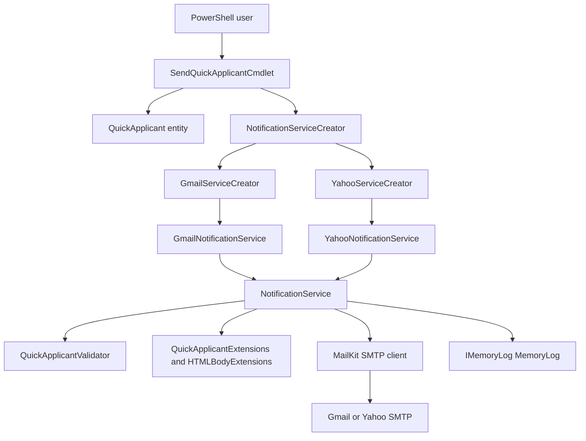
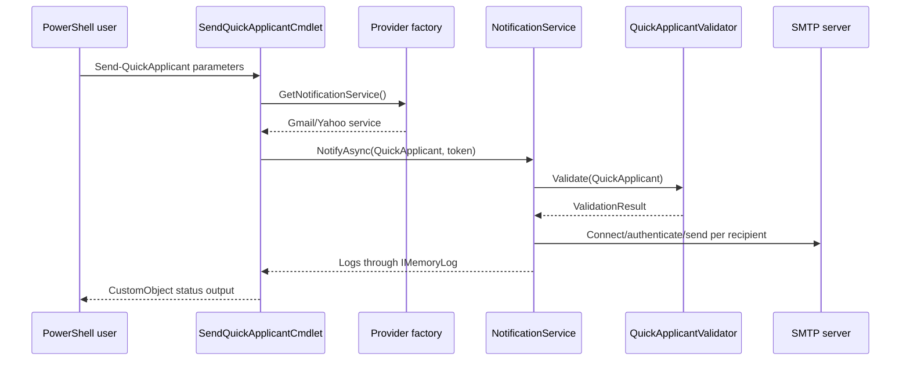

# Bluepen PowerShell Codebase Knowledge

## High-Level Overview

This repository contains a .NET 8 binary PowerShell module for sending applicant-style email notifications from PowerShell 7. The concrete user-facing command is `Send-QuickApplicant`, implemented by `bluepen.powershell.cmdlets/SendQuickApplicantCmdlet.cs`.

The solution is organized as three projects:

- `bluepen.powershell.cmdlets`: PowerShell-facing module project. It defines the cmdlet, parameters, output object, module manifest, sample content files, and packaging configuration.
- `bluepen.powershell.domain`: Shared domain contracts and simple entities. It contains `QuickApplicant`, `ValidationResult`, `IMemoryLog`, `INotificationService`, `IValidator`, and the abstract notification service creator.
- `bluepen.powershell.services`: Infrastructure/service implementations. It contains SMTP notification services, provider factories, validation, formatting extensions, and service exceptions.

The business purpose is to let a PowerShell user send the same structured notification to one or more recipients through Gmail or Yahoo SMTP. The notification can be supplied inline or through files, can include a subject/topic/signature, and can optionally include an attachment.

## Main Features and Business Purpose

### Send Gmail or Yahoo Notifications

- Entry point: `bluepen.powershell.cmdlets/SendQuickApplicantCmdlet.cs`
- Provider selection: `-Service` / `-m` / `-ms`, with `G` for Gmail and `Y` for Yahoo.
- Factories: `bluepen.powershell.services/factories/GmailServiceCreator.cs` and `bluepen.powershell.services/factories/YahooServiceCreator.cs`
- SMTP services: `bluepen.powershell.services/GmailNotificationService.cs`, `bluepen.powershell.services/YahooNotificationService.cs`, and shared base behavior in `bluepen.powershell.services/NotificationService.cs`

Business purpose: provide one reusable cmdlet that hides mail provider details from the PowerShell user while preserving provider-specific SMTP host configuration.

### Inline Recipient and Content Mode

- Parameter set: `SwitchIsOff` in `SendQuickApplicantCmdlet`.
- Required parameters: `Recipients`, `Content`, plus credentials, service, subject, topic, and signature.
- Runtime behavior: `QuickApplicant.IsFile` is false, so `QuickApplicantExtensions.GetRecipients` returns the inline recipient array and `QuickApplicantExtensions.GetContent` returns inline content.

Business purpose: support quick one-line PowerShell invocation when the user has a small recipient list and short message body.

### File-Based Recipient and Content Mode

- Parameter set: `SwitchIsOn` in `SendQuickApplicantCmdlet`.
- Required parameters: `RecipientPath`, `ContentPath`, `File`, plus credentials, service, subject, topic, and signature.
- Runtime behavior: `QuickApplicant.IsFile` is true, so recipients and content are loaded from the supplied files.
- Sample files: `bluepen.powershell.cmdlets/recipients.txt` and `bluepen.powershell.cmdlets/content.txt`.

Business purpose: support repeatable notification runs where recipient lists and message bodies are maintained outside the command line.

### Validation Before SMTP Sending

- Validator: `bluepen.powershell.services/validators/QuickApplicantValidator.cs`
- Validation result: `bluepen.powershell.domain/services/ValidationResults.cs`
- Exception type: `bluepen.powershell.services/exceptions/ContentProvidedException.cs`

The validator checks required fields, email address formatting via `MimeKit.MailboxAddress.TryParse`, file existence, and file size limits:

- Recipient file: 50 KB maximum.
- Content file: 100 KB maximum.
- Attachment file: 300 KB maximum.

Business purpose: catch malformed input before attempting SMTP authentication and sends.

### Structured Cmdlet Output and Verbose Logs

- Output type: `bluepen.powershell.services/customstructures/CustomObject.cs`
- Log abstraction: `bluepen.powershell.domain/services/interfaces/IMemoryLog.cs`
- Active log implementation: `bluepen.powershell.domain/services/MemoryLog.cs`

The cmdlet writes verbose log entries after send processing and returns a custom object with provider, recipients, status, and timestamp.

Business purpose: allow PowerShell callers to pipe or inspect structured status results while still having detailed verbose diagnostic output.

## System Architecture Deep Dive

### Component Map

### Runtime Data Flow

1. The user imports the binary module through `bluepen.powershell.cmdlets/bluepen.powershell.cmdlets.psd1` or directly through the DLL.
2. The user invokes `Send-QuickApplicant` with either inline values or `-File` mode paths.
3. `BeginProcessing` in `SendQuickApplicantCmdlet` maps `Service` to either `GmailServiceCreator` or `YahooServiceCreator`.
4. `ProcessRecord` creates a `QuickApplicant` object from cmdlet parameters, including converting `PSCredential.Password` into a plain string for SMTP authentication.
5. The selected factory creates a provider service with `QuickApplicantValidator` and the cmdlet-scoped `MemoryLog`.
6. `NotificationService.NotifyAsync` validates input, connects to SMTP over port 465 using `SecureSocketOptions.SslOnConnect`, authenticates, builds MIME content, and sends one email per recipient.
7. Logs are returned to the cmdlet and written through `WriteVerbose`.
8. The cmdlet emits `CustomObject` with provider, recipient summary, status, and timestamp.

### Sequence Diagram

## Technical Reference

### Projects and Dependencies

- `bluepen.powershell.cmdlets/bluepen.powershell.cmdlets.csproj` targets `net8.0`, references `MailKit`, `MimeKit`, and `System.Management.Automation` 7.4 with `PrivateAssets=All`, and references the domain and services projects.
- `bluepen.powershell.domain/bluepen.powershell.domain.csproj` targets `net8.0`, references `MailKit` and `MimeKit`, and excludes older `emethods`, `exceptions`, and `services/NotificationService.cs` files from compilation.
- `bluepen.powershell.services/bluepen.powershell.services.csproj` targets `net8.0`, references `FluentValidation`, `MailKit`, `MimeKit`, references the domain project, and excludes `MemoryLog.cs` from compilation.
- There is no test project in the solution.

### PowerShell Manifest and Packaging

- Manifest: `bluepen.powershell.cmdlets/bluepen.powershell.cmdlets.psd1`
- Root module: `bluepen.powershell.cmdlets.dll`
- Required assemblies: `bluepen.powershell.domain.dll`, `bluepen.powershell.services.dll`, `MailKit.dll`, and `MimeKit.dll`
- File list: `attachment.pdf`, `content.txt`, and `recipients.txt`
- Build packaging: `bluepen.powershell.cmdlets.csproj` copies sample artifacts and uses a post-build `xcopy` step to create `Publish/bluepen.powershell.cmdlets`.

### Key Classes and Responsibilities

| Path | Type | Responsibility |
| --- | --- | --- |
| `bluepen.powershell.cmdlets/SendQuickApplicantCmdlet.cs` | Cmdlet | Defines PowerShell parameters, provider selection, `ShouldProcess`, cancellation, service invocation, verbose logs, and structured output. |
| `bluepen.powershell.domain/entities/QuickApplicant.cs` | Entity | Carries credential, recipient, content, attachment, subject, topic, signature, and file-mode state across layers. |
| `bluepen.powershell.domain/services/abstracts/NotificationServiceCreator.cs` | Abstract factory | Defines the provider service creation contract. |
| `bluepen.powershell.services/factories/GmailServiceCreator.cs` | Factory | Creates `GmailNotificationService` with `QuickApplicantValidator` and `IMemoryLog`. |
| `bluepen.powershell.services/factories/YahooServiceCreator.cs` | Factory | Creates `YahooNotificationService` with `QuickApplicantValidator` and `IMemoryLog`. |
| `bluepen.powershell.services/NotificationService.cs` | Service base | Performs validation, SMTP connection, MIME body creation, attachment loading, per-recipient send loop, and logging. |
| `bluepen.powershell.services/validators/QuickApplicantValidator.cs` | Validator | Validates required fields, email addresses, file existence, and file size limits. |
| `bluepen.powershell.services/emethods/QuickApplicantExtensions.cs` | Extensions | Reads recipients/content from inline values or files based on `IsFile`. |
| `bluepen.powershell.services/emethods/HTMLBodyExtensions.cs` | Extensions | Replaces `{topic}` and `{signature}` tokens and converts newlines to ` `. |
| `bluepen.powershell.domain/services/MemoryLog.cs` | Log implementation | Stores per-invocation log entries for verbose output. |
| `bluepen.powershell.services/customstructures/CustomObject.cs` | Output DTO | Represents provider, recipients, status, and timestamp returned from the cmdlet. |

## Feature-by-Feature Analysis

### Cmdlet Parameter Binding

`SendQuickApplicantCmdlet` uses two parameter sets. `SwitchIsOff` requires inline `Recipients` and `Content`. `SwitchIsOn` requires `RecipientPath`, `ContentPath`, and the `File` switch. Both modes require credentials, service, subject, topic, and signature. This is the primary usability contract for callers.

Important behavior: properties such as `Content`, `ContentPath`, `Recipients`, and `RecipientPath` are declared as nullable-enabled `required` properties, but not all are populated in each parameter set. The code depends on parameter-set behavior and validator branches to avoid using inactive properties.

### Provider Selection

`BeginProcessing` normalizes `Service` with `ToUpper()` and accepts only `G` or `Y`. `G` maps to Gmail and `Y` maps to Yahoo. Any other value writes a PowerShell error. If provider creation fails, `serviceCreator` can remain null and later `ProcessRecord` may silently skip service work because it uses null-conditional calls.

### Validation and File Loading

Validation happens inside `NotificationService.NotifyAsync`, before SMTP connection. File mode reads recipient and content files during validation and then reads them again through `QuickApplicantExtensions` during message creation. Inline mode validates the recipient array and content string directly.

### SMTP Notification Sending

`NotificationService` uses one SMTP connection for the whole operation and sends one `MimeMessage` per recipient. It builds both HTML and plain text bodies. The HTML body is not HTML-encoded; it is generated by direct string replacement and newline conversion. Attachments are loaded fully into memory with `File.ReadAllBytes`.

### Logging and Output

Each successful recipient send logs username, subject, topic, and signature. Per-recipient exceptions are caught and logged. Outer exceptions, including validation and SMTP connection failures, are also caught and logged. After the service returns, the cmdlet writes all logs as verbose output and always emits `Status = "Sent"` if no exception escapes to the cmdlet.

## Cross-Cutting Concerns

### Security

- Credentials are supplied as `PSCredential`, but the secure password is converted into a plain string for MailKit authentication.
- SMTP authentication uses provider app passwords.
- Message content is inserted into HTML without encoding, which can create malformed HTML or unsafe rendered email content when user-controlled input contains markup.
- Verbose logs include sender username and message metadata.

### Error Handling

- Service-level errors are swallowed into `IMemoryLog` instead of propagated.
- The cmdlet's output status can report `Sent` even when validation or SMTP send failed.
- Provider selection errors in `BeginProcessing` do not stop `ProcessRecord`.

### Cancellation

- `SendQuickApplicantCmdlet.StopProcessing` cancels a `CancellationTokenSource`.
- The send loop checks cancellation before each send and passes the token into MailKit operations and `Task.Delay`.
- `ProcessRecord` disposes the token source in `finally`, making this cmdlet suitable for a single processing cycle rather than repeated reuse.

### Logging

- Active logging is instance-based through `bluepen.powershell.domain/services/MemoryLog.cs`.
- `bluepen.powershell.services/MemoryLog.cs` is excluded from compilation by the services project and should be treated as inactive code unless the project file changes.

### Packaging

- `System.Management.Automation` is excluded from private packaging because PowerShell supplies it at runtime.
- The `.psd1` manifest lists required assemblies but not `System.Management.Automation.dll`.
- The cmdlet project includes direct package content entries based on `$(TargetDir)`/`$(OutputPath)` and a post-build `xcopy` command. This is Windows-oriented packaging logic.

## Things You Must Know Before Changing Code

- The user-visible command is a binary cmdlet, so public parameter names, aliases, parameter sets, and output shape are compatibility-sensitive.
- `Service` accepts terse values (`G`, `Y`) rather than provider names. Adding providers requires changes to the cmdlet switch, a factory, and an SMTP service configuration.
- `NotifyAsync` currently treats many failures as log entries instead of exceptions. Any fix to status reporting should decide whether partial sends are success, failure, or mixed outcome.
- The HTML formatter performs raw string replacement. Any change to templating should preserve `{topic}` and `{signature}` behavior unless the public contract is intentionally changed.
- Attachments are size-limited by validation but still loaded entirely into memory.
- File mode validates file contents and then re-reads files later, so content can change between validation and send.
- There are no automated tests, so refactors need at least focused unit tests around validation and message-building behavior before larger changes.
- Some domain files exist under folders excluded by project files. Confirm compilation includes before treating duplicate files as active behavior.

## Glossary

- QuickApplicant: The domain object that carries all inputs needed to send a notification.
- Notification: An email message sent to one recipient through Gmail or Yahoo SMTP.
- Provider: The selected mail service, currently Gmail or Yahoo.
- File mode: Cmdlet mode where recipients and content are loaded from file paths.
- Inline mode: Cmdlet mode where recipients and content are supplied as command parameters.
- App password: Provider-generated password used for SMTP authentication instead of the normal mailbox password.
- MemoryLog: Per-invocation in-memory log used to transfer service diagnostics back to cmdlet verbose output.

## Open Questions

- Should failed validation or SMTP failure produce terminating errors, non-terminating errors, or a structured failed output object?
- Should the module support provider names like `Gmail` and `Yahoo`, or only `G` and `Y`?
- Should file size limits be configurable instead of hardcoded?
- Should partial sends report per-recipient status instead of one aggregate `Sent` status?
- Should the module target PowerShell 7.4 only, or a wider PowerShell 7 range?

## STATE BLOCK

- INDEX_VERSION: 1
- FILE_MAP_SUMMARY: `README.md`; `Requirements.md`; `bluepen.powershell.sln`; cmdlet project, manifest, sample files, and `SendQuickApplicantCmdlet.cs`; domain entity, interfaces, abstract factory, validation result, and memory log; services SMTP base class, Gmail/Yahoo subclasses, factories, validator, extensions, exception, and output DTO.
- OPEN_QUESTIONS: Error/status semantics, provider naming, configurable limits, per-recipient results, supported PowerShell versions.
- KNOWN_RISKS: False `Sent` status after logged failures; raw HTML insertion; plain-string password conversion; Windows-only post-build packaging; no automated tests; duplicate inactive source files.
- GLOSSARY_DELTA: QuickApplicant, Notification, Provider, File mode, Inline mode, App password, MemoryLog.